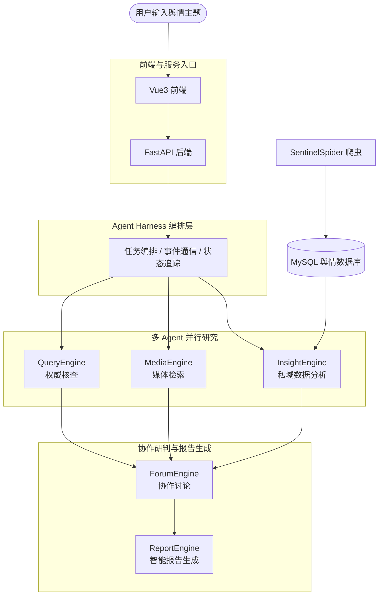

# 多 Agent Harness 舆情智能分析平台


基于 **FastAPI + Vue3 + LangGraph + MySQL** 构建的多 Agent 舆情分析 Harness 平台。系统输入一个舆情主题后，由 Harness 编排层统一调度多个专业 Agent，汇总本地数据库、网络媒体和权威来源的信息，并生成结构化分析报告。

核心能力：

- 私域舆情数据挖掘
- 媒体传播路径分析
- 权威信息核查
- 多 Agent 协作讨论
- HTML 舆情报告生成

## Harness 工程化设计

本项目重点不只是调用大模型，而是实现了一套面向复杂任务的 **Agent Harness**：把模型、工具、数据源、事件流和报告生成流程组织成可运行、可观测、可部署的工程系统。

- **任务编排**：SearchService 同时拉起 Insight、Media、Query 三个研究引擎，覆盖私域数据、媒体传播和权威核查视角。
- **工作流控制**：各引擎内部使用 LangGraph 组织“生成大纲、搜索、摘要、反思、再搜索、格式化报告”的研究流程。
- **事件通信**：EventBus 统一发布进度、摘要、错误和论坛消息，前端通过 SSE 实时展示 Agent 运行状态。
- **协作汇总**：ForumEngine 监听多引擎中间结果，模拟主持人协作讨论；ReportEngine 汇总三路报告与论坛日志，生成最终 HTML 报告。
- **部署闭环**：通过 Docker Compose 编排前端、后端和 MySQL，支持本地演示与服务器部署。

## 架构图



## 运行前准备

本地开发环境：

```text
Python 3.12+
uv
Node.js 20+
MySQL 8.0
```

Docker 部署环境：

```text
Docker
Docker Compose
```

## 配置

复制配置模板：

```bash
cp .env.example .env
```

主要需要填写这些配置：

```env
# 数据库
DB_DIALECT=mysql
DB_HOST=127.0.0.1
DB_PORT=3306
DB_USER=root
DB_PASSWORD=your_db_password
DB_NAME=media_crawler
DB_CHARSET=utf8mb4

# Docker MySQL 映射端口，本机 3306 被占用时用 3307
DB_EXPOSE_PORT=3307

# 前端端口
FRONTEND_PORT=80

# Agent 大模型配置
INSIGHT_ENGINE_API_KEY=your_key
INSIGHT_ENGINE_BASE_URL=https://api.deepseek.com
INSIGHT_ENGINE_MODEL_NAME=deepseek-v4-pro

MEDIA_ENGINE_API_KEY=your_key
MEDIA_ENGINE_BASE_URL=https://api.deepseek.com
MEDIA_ENGINE_MODEL_NAME=deepseek-v4-pro

QUERY_ENGINE_API_KEY=your_key
QUERY_ENGINE_BASE_URL=https://api.deepseek.com
QUERY_ENGINE_MODEL_NAME=deepseek-v4-pro

REPORT_ENGINE_API_KEY=your_key
REPORT_ENGINE_BASE_URL=https://api.deepseek.com
REPORT_ENGINE_MODEL_NAME=deepseek-v4-pro

FORUM_HOST_API_KEY=your_key
FORUM_HOST_BASE_URL=https://api.deepseek.com
FORUM_HOST_MODEL_NAME=deepseek-v4-pro

KEYWORD_OPTIMIZER_API_KEY=your_key
KEYWORD_OPTIMIZER_BASE_URL=https://api.deepseek.com
KEYWORD_OPTIMIZER_MODEL_NAME=deepseek-v4-pro

# 搜索工具
SEARCH_TOOL_TYPE=TavilyAPI
TAVILY_API_KEY=your_tavily_api_key
```

如果不需要本地情感分析模型，保持默认关闭即可：

```env
SENTIMENT_ANALYSIS_ENABLED=false
ENABLE_SENTIMENT_PER_SEARCH=false
```

## 本地运行

安装后端依赖：

```bash
uv sync
```

启动后端：

```bash
uv run python main.py
```

后端 API 文档：

```text
http://localhost:5000/docs
```

启动前端：

```bash
cd frontend
npm install
npm run dev
```

前端访问地址：

```text
http://localhost:5173
```

## Docker 运行

构建并启动：

```bash
docker compose up -d --build
```

查看容器状态：

```bash
docker compose ps
```

查看日志：

```bash
docker compose logs -f backend
docker compose logs -f frontend
docker compose logs -f db
```

默认访问地址：

```text
前端：http://localhost/
后端：http://localhost:5000
MySQL：127.0.0.1:3307
```

如果服务器 80 端口被占用，修改 `.env`：

```env
FRONTEND_PORT=8080
```

然后重新启动：

```bash
docker compose up -d
```

## 数据库初始化和导入

Docker 启动时会自动创建数据库表，但不会自动带入你本机已有的爬虫数据。

从本机 MySQL 导出：

```powershell
mysqldump -h 127.0.0.1 -P 3306 -u root -p --default-character-set=utf8mb4 --hex-blob --routines --triggers --single-transaction --result-file=media_crawler.sql media_crawler
```

导入 Docker MySQL：

```powershell
cmd /c "mysql -h 127.0.0.1 -P 3307 -u root -p --default-character-set=utf8mb4 media_crawler < media_crawler.sql"
```

验证导入结果：

```powershell
mysql -h 127.0.0.1 -P 3307 -u root -p -e "USE media_crawler; SHOW TABLES; SELECT COUNT(*) FROM douyin_aweme;"
```

部署到服务器时，需要把 `media_crawler.sql` 单独传到服务器并重新导入。

## 爬虫采集示例

进入 MediaCrawler 目录：

```bash
cd tools/SentinelSpider/DeepSentimentCrawling/MediaCrawler
```

按关键词采集抖音数据并写入数据库：

```bash
python main.py --platform dy --lt qrcode --type search --keywords "给阿嫲的情书" --save_data_option db
```

常见写入表：

```text
douyin_aweme
douyin_aweme_comment
daily_news
daily_topics
```

## 服务器部署

在服务器拉取代码：

```bash
git clone https://github.com/XiaoFeiCode/AgentResearchPlatform.git
cd AgentResearchPlatform
```

创建配置：

```bash
cp .env.example .env
nano .env
```

启动服务：

```bash
docker compose up -d --build
```

如果需要导入本机数据，先上传 `media_crawler.sql`，然后执行：

```bash
docker exec -i sentinelai-db mysql -uroot -p media_crawler < media_crawler.sql
```

访问：

```text
http://服务器IP/
```

## 运行示例

示例文件位于：

```text
docs/examples/
```

当前示例包含一次完整运行后生成的最终 HTML 报告，主题为：

```text
给阿嫲的情书
```

可直接打开：

```text
docs/examples/final_report_智能舆情分析报告_20260530_154827.html
```
